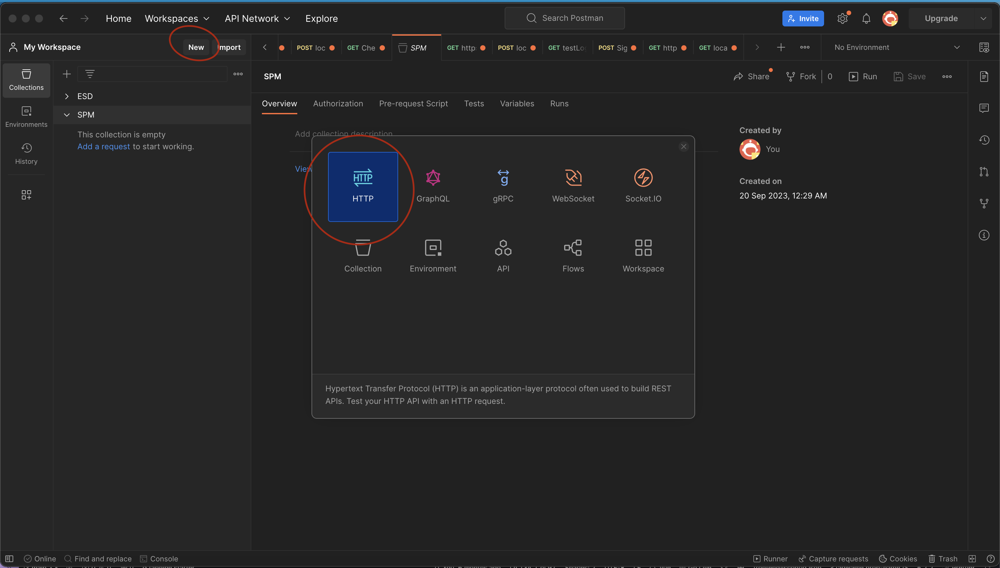

# Database

## How to setup database

1. Open MySQL Database
2. Press the "+" icon

3. Insert the following:
    - Connection Name: can be anything you want
    - hostname: sent in group chat
    - port: 3306 
    - username: admin
    - password: sent in group chat
4. Press Test Connection and you should see this

    

5. Then you are good to go ! 

## How to setup .env file

If the `.env.example` file exists, change it to .env and add the env variables which is stated in our document/group chat.

If it does not exist, create a `.env` file on your own. When you push, remember to create a new `.env.example` as well

## How to test the connection

1. First you navigate to the database folder.
2. Run the following command on terminal.

    `node crud`
3. Now go to PostMan and create a new collection and a new HTTP request.

      

4. Type in the URL "http://localhost:3000/readAllRoles"

5. You should be able to see the response that some listings have been pulled.


## How to use the functions 

### Create

```
function createRole() {
  const roleId = {insert roleId}; 
  const roleName = {insert roleName};
  const dept = {insert dept};
  const country = {insert country};
  const numOpenings = {insert numOpenings};
  const expiryDate = {insert expiryDate}; // YYYY-MM-DD format
  const openVal = {insert open};
  const query = `INSERT INTO role (role_id, role_name, dept, country, num_openings, expiry_date, open) VALUES ('${roleId}', '${roleName}', '${dept}', '${country}', '${numOpenings}', '${expiryDate}', '${openVal}');`;
  con.query(query, function (error, results, fields) {
    if (error) throw error;
    console.log('success'); // Returns success 
    return results;
  });
}
```

### Read

```
function readRole() {
  const query = `SELECT * FROM ROLE`;
  con.query(query, function (error, results, fields) {
    if (error) throw error;
    console.log("success");
    return results;
  });
}
```

### Update
WIP

### Delete 
WIP

