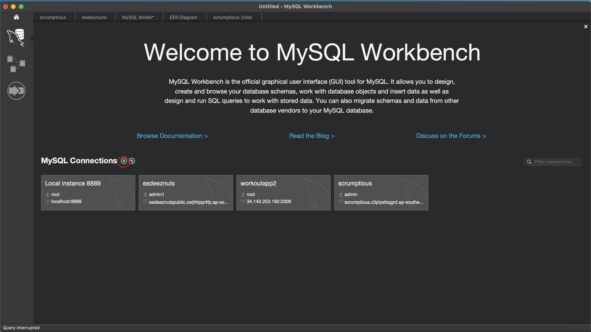
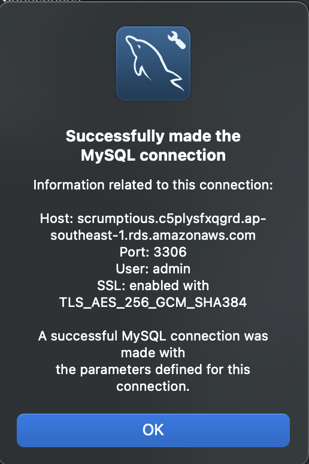

# Database

## How to setup database

1. Open MySQL Database
2. Press the "+" icon

3. Insert the following:
    - Connection Name: can be anything you want
    - hostname: scrumptious.c5plysfxqgrd.ap-southeast-1.rds.amazonaws.com
    - port: 3306 
    - username: admin
    - password: sent in group chat
4. Press Test Connection and you should see this

    

5. Then you are good to go ! 

## How to use the functions 

### Create

```
function createRole() {
  const roleId = {insert roleId}; 
  const roleName = {insert roleName};
  const dept = {insert dept};
  const country = {insert country};
  const numOpenings = {insert numOpenings};
  const expiryDate = {insert expiryDate}; // YYYY-MM-DD format
  const openVal = {insert open};
  const query = `INSERT INTO role (role_id, role_name, dept, country, num_openings, expiry_date, open) VALUES ('${roleId}', '${roleName}', '${dept}', '${country}', '${numOpenings}', '${expiryDate}', '${openVal}');`;
  con.query(query, function (error, results, fields) {
    if (error) throw error;
    console.log('success'); // Returns success 
    return results;
  });
}
```

### Read

```
function readRole() {
  const query = `SELECT * FROM ROLE`;
  con.query(query, function (error, results, fields) {
    if (error) throw error;
    console.log("success");
    return results;
  });
}
```

### Update
WIP

### Delete 
WIP

